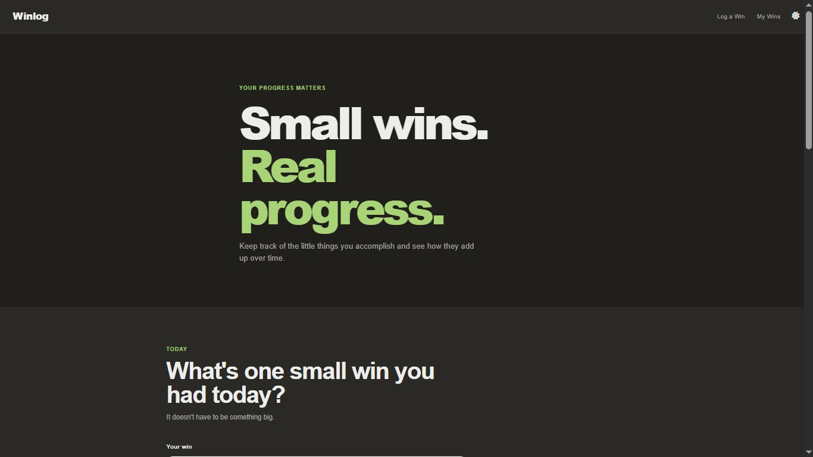
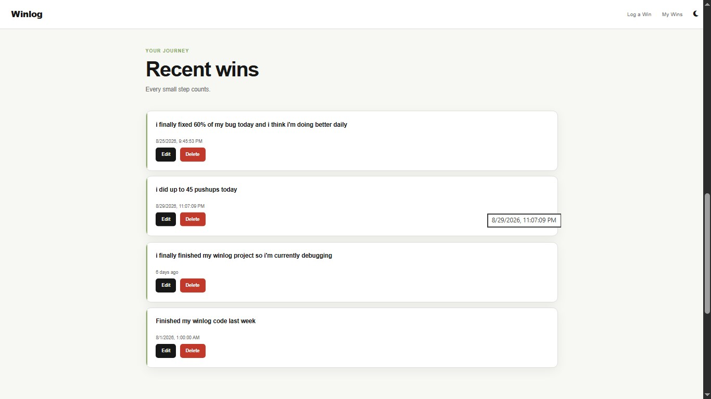

# Winlog 🌱

### Small wins. Real progress.

Winlog is a simple personal progress tracker built around one idea:

> **Every win counts, no matter how small.**

It's easy to overlook the little things we accomplish every day — finishing a task, finally understanding something, showing up when we didn't feel like it, learning something new, or simply making progress.

Winlog gives those moments a place to live.

Instead of only looking at big milestones, you can record your everyday wins and gradually build a record of your progress. At the end of a month, Winlog helps you look back and recognize how far you've come.

## 📸 Screenshots

### Dashboard


.jpg>)

### Your Wins



### Monthly Reflection


---

## ✨ What Winlog Does

* 📝 **Log daily wins** — Record anything you're proud of accomplishing, no matter how small.
* 📊 **Track your progress** — See your total wins alongside your wins for the current week and month.
* 🗂️ **Review past wins** — Look back at the things you've accomplished over time.
* ✏️ **Edit or delete wins** — Keep your win log accurate and up to date.
* 🌓 **Dark mode** — Switch between light and dark themes.
* 🤖 **Monthly reflection** — After a month is completed, Winlog uses AI to generate a short reflection based on the wins you recorded.
* 💾 **Local storage** — Your wins and theme preference are stored locally in your browser.

---

## 💡 Why Winlog?

Progress doesn't always look like a huge achievement.

Sometimes progress is:

* Finally understanding a difficult concept.
* Writing your first line of code after struggling with a problem.
* Completing a task you've been putting off.
* Reading a few pages of a book.
* Going for a walk.
* Practicing a skill.
* Showing up and trying again.

These moments can feel insignificant when viewed individually.

But when you collect them over time, they tell a different story.

**Winlog is designed to help you see that story.**

---

## 🧠 Monthly Reflection

One of the main ideas behind Winlog is being able to look back at a completed month instead of simply moving on to the next one.

Winlog collects the wins recorded during a previous month and sends them to an AI-powered reflection service. The service looks for patterns and themes in those wins and produces a short, encouraging reflection.

The goal isn't to judge how many wins you had.

There is no "good enough" number.

The reflection is simply a way to pause, look back, and recognize the progress that happened during that period. The AI prompt is specifically designed to avoid comparing the number of wins or suggesting that the user should have achieved more.

---

## 🛠️ Built With

* **HTML**
* **CSS**
* **JavaScript**
* **LocalStorage**
* **Groq API**
* **Llama 3.3 70B**
* **Vercel Serverless Functions**

The frontend handles logging, displaying, editing, deleting, and calculating win statistics, while the reflection feature communicates with a backend API endpoint.

---

## 📈 Progress Tracking

Winlog currently keeps track of three simple metrics:

| Metric         | Description                            |
| -------------- | -------------------------------------- |
| **Total Wins** | Every win recorded                     |
| **This Week**  | Wins recorded during the current week  |
| **This Month** | Wins recorded during the current month |

These numbers aren't meant to turn progress into a competition.

They're simply another way to make progress visible.

---

## 💾 Data & Privacy

Winlog stores your logged wins in your browser using `localStorage`.

This means your win history is persisted on your device/browser rather than being stored in a traditional database.

For the monthly reflection feature, the wins from the relevant month are sent to the reflection API so that an AI-generated reflection can be created.

---

## 🚀 Getting Started

### 1. Clone the repository

```bash
git clone https://github.com/your-username/winlog.git
cd winlog
```

### 2. Open the project

If you're working with the frontend locally, you can open the project in your browser or run it through your preferred local development setup.

### 3. Configure the API

The monthly reflection feature requires a Groq API key.

Create an environment variable:

```env
GROQ_API_KEY=your_api_key
```

The API uses Groq's chat completion endpoint and the `llama-3.3-70b-versatile` model to generate the monthly reflection.

**Never commit your API key to GitHub.**

---

## 🌱 The Philosophy

Winlog isn't about becoming more productive every single day.

It's about noticing progress that you might otherwise forget.

A small win today might not feel important.

But months later, seeing dozens of those moments together can remind you that you weren't standing still.

**Small wins. Real progress.**

---

## 🔮 Future Ideas

Some features that could eventually make Winlog even more useful:

* 📅 Monthly progress comparisons
* 📊 Progress charts and visualizations
* 🔍 Search and filter through past wins
* 🏷️ Categories or tags for wins
* 📆 Calendar-based win history
* 📈 Long-term progress trends
* ✨ More detailed monthly reflections
* 📤 Export your win history

---

## 📄 License
Built by [Olubayo](https://github.com/Olaolubayo).

This project is open source and available under the [MIT License](LICENSE).

---

### Built to remind you that progress doesn't always have to be big to matter.

**Winlog — Small wins. Real progress.**
